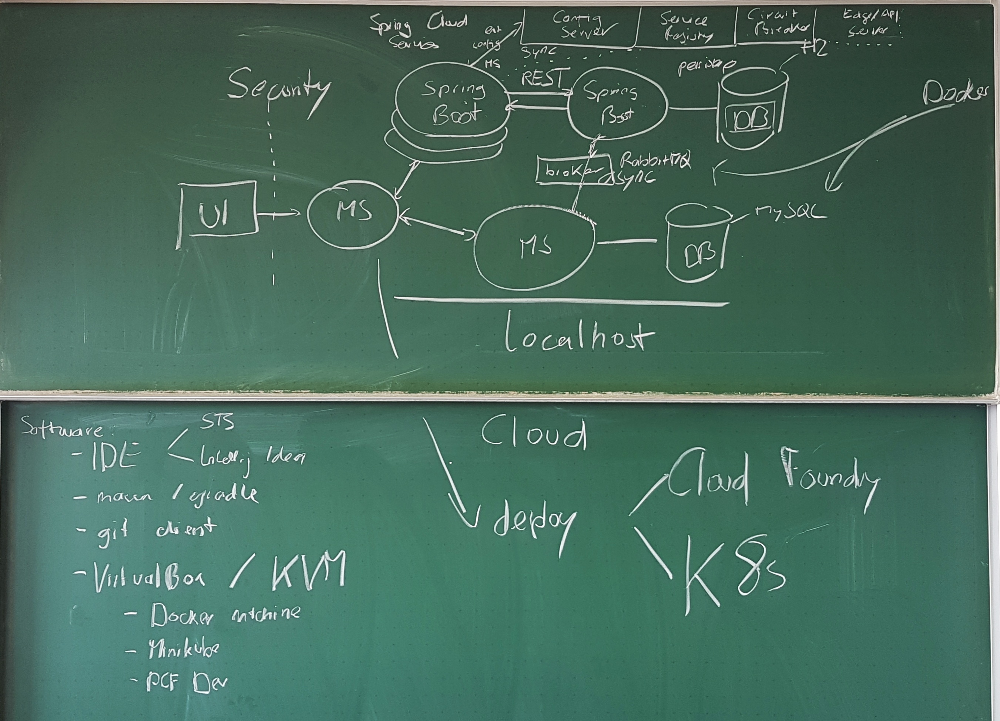

### Hochschule Esslingen

## Cloud Native Development

# Class Outline

---

---

---

## Session 1

# Cloud Introduction

+++

# Content

* What is Cloud?
* History
* Terminology
* Iaas/PaaS/SaaS
* Virtual Machines
* Containers

+++

# Slides

in moodle

+++

# Exercises

https://blog.novatec-gmbh.de/howto-get-started-pivotal-cloudfoundry-local-public/

---

## Session 2

# Development & Spring Boot Intro

+++

# Content

* IDEs
* REST (Clients)
* Maven & Gradle
* Git
* What is Spring Boot
* Spring Initializr
* REST Interface
* Actuator

+++

# Slides

in moodle

+++

# Exercises

Basic:
- Set up IDE for Spring Boot Development (Spring Tool Suite, IntelliJ idea recommended)
- Build a new Spring Boot application using start.spring.io using "Web" dependency
- Extend the application to retrieve dynamic data from a property
- Extend the application to modify data of a property using HTTP POST

+++

Advanced:
- Add the actuator dependency to the application
- Change the security settings in the application properties
- Run a second instance of the application on another port
- Try to implement the REST Calls using GET, PUT, POST and DELETE

---

## Session 3

# Docker Intro

+++

# Slides

in moodle //TODO

+++

# Exercises

+++

- Create an account on https://hub.docker.com/
- Pull and run the offical „Hello World“ container and try to understand the output http://training.play-with-docker.com/helloworld/
- Pull and run the image „alpine:latest“, go into the container and find out which linux kernel version is used. In order to do so, run „uname -r“ within the container. Leave the container with „exit“
http://training.play-with-docker.com/alpine/

+++

- Write your own Dockerfile based on the alpine:latest image (FROM alpine:latest).
- When running the container it should print out your first name. 
- Build and tag the image yourDockerID/myFirstImage:v1
- Push it to the DockerHub
- Pull the image of the person next to you and run it. Check if it prints out the name
- Optional: Let the container print your first name and your favorite color. Push it with the tag yourDockerID/myFirstImage:v2

+++

### Advanced 

(http://training.play-with-docker.com/webapps/)

- Run a static website in a container (2.1.)
- Run the python-flask-app in a container (2.3.)
- You do not necessarily need to create the app. All files are provided over Moodle. Try to understand the port mapping

---

## Session 4

# Spring Data

+++

# Slides

in moodle //TODO remove Thymelead and other stuff 

+++

# Content

- Persistence mechanisms in Spring (Boot)
- SQL, Hibernate, JPA
- Entity and Repository objects
- In-memory, document-based and classic/relational DBs

+++

Exercises:

https://gitpitch.com/maeddes/gitpitch-spring-data#/

---

## Session 5

# Communication in Spring

---

